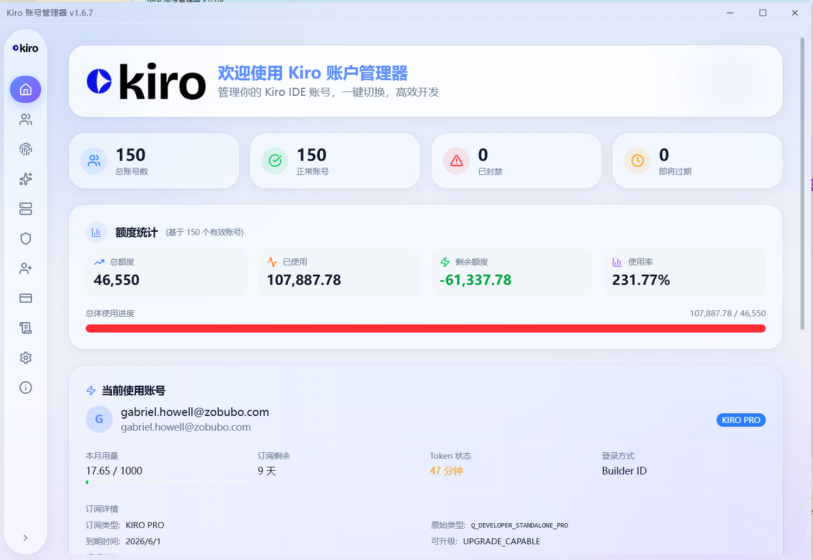
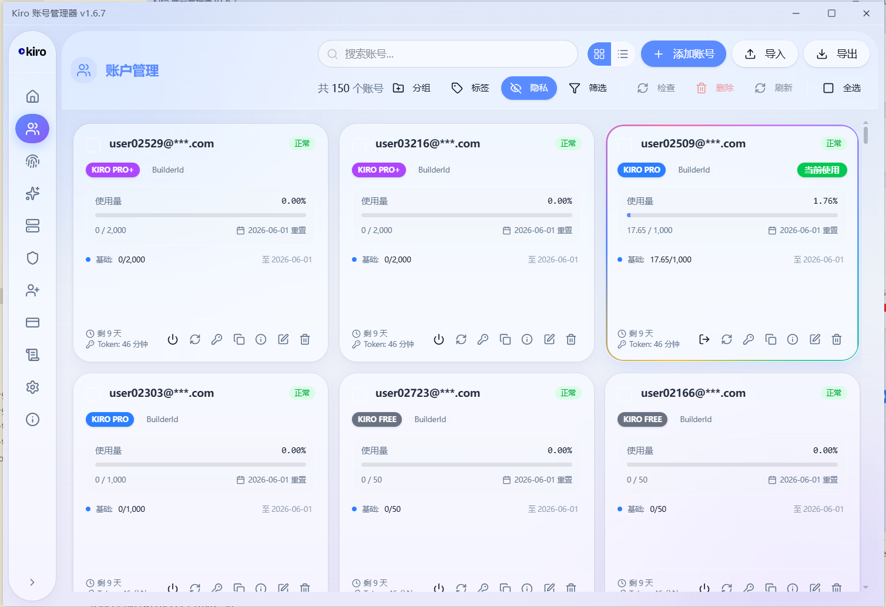

# Kiro Account Manager

<p align="center">
  
</p>

<p align="center">
  <strong>A powerful multi-account management tool for Kiro IDE</strong>
</p>

<p align="center">
  Quick account switching, auto token refresh, group/tag management, machine ID management and more
</p>

<p align="center">
  <strong>English</strong> | <a href="README_CN.md">简体中文</a>
</p>

---

## ✨ Features

### 🔐 Multi-Account Management
- Add, edit, and delete multiple Kiro accounts
- One-click quick account switching
- Support Builder ID and Social (Google/GitHub) login methods
- Batch import/export account data

### 🔄 Auto Refresh
- Auto refresh tokens before expiration
- Auto update account usage and subscription info after refresh
- Periodically check all account balances when auto-switch is enabled

### 📁 Groups & Tags
- Flexibly organize accounts with groups and tags
- Batch set groups/tags for multiple accounts

### 🔑 Machine ID Management
- Modify device identifier to prevent account association bans
- Auto switch machine ID when switching accounts
- Assign unique bound machine ID to each account

### 🔄 Auto Account Switch
- Auto switch to available account when balance is low
- Configurable balance threshold and check interval

### ⚙️ Kiro IDE Settings Sync
- Sync Kiro IDE settings (Agent mode, Model, MCP servers, etc.)
- Edit MCP server configurations
- Manage user rules (Steering files)

### 🌐 Multi-Language Support
- Full English/Chinese bilingual interface
- Auto-detect system language or manual selection

### 🎨 Personalization
- 21 theme colors available
- Dark/Light mode toggle
- Privacy mode to hide sensitive information

### 📝 Account Registration
- Built-in Kiro Builder ID registration
- Four modes: Manual, MoEmail (temp email), Outlook IMAP, Custom Domain (TempMail.Plus)
- Concurrent batch registration with configurable parallelism (1-10)
- Auto-import registered accounts after verification
- Registration history with one-click import
- Session-persistent logs, progress, and history
- Full i18n support

### 🌐 Proxy Support
- Support HTTP/HTTPS/SOCKS5 proxy

---

## 📸 Screenshots

### Home


### Account Management


### Machine ID Management


### Settings


### Kiro IDE Settings


### Theme Colors


### About


---

## 🛠️ Tech Stack

- **Frontend**: React 18 + TypeScript
- **Desktop**: Electron
- **State Management**: Zustand
- **UI Components**: Radix UI + Tailwind CSS
- **Icons**: Lucide React
- **Build Tool**: Vite

---

## 🚀 Development

```bash
# Install dependencies
npm install

# Start development server
npm run dev

# Build for production
npm run build

# Type check
npm run typecheck
```

---

## 📋 Changelog

### Current

#### Proxy API Enhancements
- **New**: Gemini v1beta API compatibility (`/v1beta/models`, `/v1beta/models/{model}:generateContent`, `/v1beta/models/{model}:streamGenerateContent`)
- **New**: One-click client configuration now supports 6 clients: Claude Code, OpenCode, Codex CLI, Gemini CLI, Hermes, OpenClaw
- **New**: AmazonQ CLI endpoint isolation — `amazonq-cli` preferred endpoint uses only SendMessageStreaming, no fallback
- **New**: Smart account rotation with Circuit Breaker + Sticky behavior + Exponential backoff + Probabilistic retry (inspired by Kiro Gateway)
- **New**: Error classification system — `FATAL` (bad request, return immediately) vs `RECOVERABLE` (account issue, try next)
- **New**: Proactive quota filtering — exhausted accounts are excluded before selection, not just after 429 errors
- **New**: `onPoolEmpty` lazy-sync callback — proxy auto-loads accounts from store on first request (fixes Mac cold-start 503)
- **New**: Retry mechanism for account pool sync on cold boot (5 retries, 2s/4s/6s/8s/10s)
- **New**: Model capability badges — Thinking/Caching/Effort labels from ListAvailableModels response
- **New**: Hidden model support — Claude 3.7 Sonnet and other models not in official list but supported by backend
- **Optimization**: Request headers/UA/versions fully match official Kiro IDE 0.12.155 capture (SDK 1.0.34, dynamic OS/Node fingerprint)
- **Optimization**: Request body now includes agentContinuationId/agentTaskType fields matching official protocol
- **Optimization**: All outbound requests routed through app-level HTTP proxy (Token refresh, SSO login, image download, etc.)
- **Optimization**: machineId fallback (SHA-256 hash), Token refresh jitter (0-3s), IDC UA dynamic OS
- **Optimization**: K-Proxy MITM now replaces machineId in body + intercepts telemetry domain kiro.dev
- **Optimization**: Tool call token estimation covers all exit paths (tool name + argument JSON)
- **Optimization**: Detailed 503 error messages now include quota status (`All accounts quota exhausted (X/Y exhausted, Z in cooldown)`)
- **Optimization**: Extended quota error detection patterns (402, 429, ThrottlingException, ServiceQuotaExceededException, rate limit, limit exceeded)
- **New**: Stream events toggle — off by default, shows detailed JSON for each stream event (assistantResponseEvent/toolUseEvent etc.) when enabled
- **Optimization**: Thinking mode simplified — removed legacy `<thinking>` tag detection, directly passes through native reasoningContentEvent as OpenAI `reasoning_content` / Claude thinking block
- **New**: `additionalModelRequestFields` support — client `thinking` parameter is passed through to Kiro API

#### Account Switching
- **New**: Kiro CLI account switching support — writes credentials to `~/.local/share/kiro-cli/data.sqlite3` SQLite database
- **New**: Configurable switch target in Settings: "Kiro IDE" / "Kiro CLI" / "Both (IDE + CLI)" (default: IDE)
- **New**: Auto-switch and manual switch both respect `switchTarget` setting
- **New**: CLI switch uses Read-Merge-Write strategy, preserves unknown fields, clears stale priority keys

#### Subscription & Overage
- **New**: Batch overage settings page with "Enable Overage" (unset only) and "Set All" (all subscribed) buttons
- **New**: Account overage status overview table (subscription type, overage capability, overage status)
- **Fix**: `overageStatus` field detection — correctly maps REST API `"ENABLED"`/`"DISABLED"` strings to boolean
- **Fix**: Batch check and batch refresh now return `resourceDetail` and `overageCapability` to frontend

#### UI & UX
- **New**: RegisterPage fully redesigned with Card/Button/Input/Label/Progress/Badge/Switch components
- **New**: SubscriptionPage header redesigned with gradient banner
- **New**: Both pages support theme color switching and dark mode
- **Fix**: Batch registration progress/history now survives page navigation (module-level React setter refs)
- **Fix**: Console encoding on Windows (`chcp 65001` in dev script for proper UTF-8 Chinese output)

#### Registration
- **New**: Account registration feature (Manual / MoEmail / Outlook / Custom Domain modes)
- **New**: Custom Domain mode — user provides domain with catch-all forwarding to TempMail.Plus, system generates realistic random English name email prefixes for registration
- **New**: Concurrent batch registration — configurable parallelism (1-10 simultaneous tasks)
- **New**: Batch registration with auto-import, retry on failure, per-item status tracking
- **New**: Manual mode step progress indicator
- **New**: Auto-import after registration (all modes: manual, MoEmail, Outlook, Custom Domain)
- **New**: Session-persistent registration state (logs, phase, history survive page navigation)
- **New**: Mid-registration cancel support for manual mode
- **New**: Full i18n for registration page (en/zh)

#### Bug Fixes
- **Fix**: Model alias mapping now uses exact matches only, so dynamic models such as `claude-opus-4.7` are no longer downgraded to static Claude aliases
- **Fix**: Proxy test page now loads real `/v1/models` results and avoids defaulting to unavailable static Claude aliases
- **Fix**: Unknown model IDs are now passed through instead of being remapped to a static Claude default
- **Fix**: Default proxy endpoint order now prioritizes AmazonQ with CodeWhisperer as fallback
- **Fix**: Proxy API stream requests now route through app-level HTTP proxy settings
- **Fix**: CodeWhisperer requests resolve short model aliases to official `ListAvailableModels` IDs
- **Fix**: CodeWhisperer requests include official `x-amzn-kiro-agent-mode` header
- **Fix**: Resolved white screen on registration page (TDZ error)
- **Fix**: Fixed duplicate account import after manual mode registration
- **Fix**: Upgraded TLS profile from `chrome_131` to `chrome_144`
- **Fix**: Corrected `tlsclientwrapper` API usage — body as 2nd arg, options as 3rd arg

See [root README](../README.md#-changelog) for full changelog.
